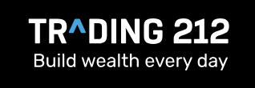

# Stock Anomaly Detector

A real-time stock market anomaly detection system with interactive visualization. Stream historical or synthetic stock data and detect various types of market anomalies using both built-in and custom detection algorithms.



## Features

### Real-Time Data Streaming
- **Live WebSocket Updates**: Stream stock data in real-time without page reloads
- **Variable Speed Playback**: Control streaming speed from 1x to 100x
- **Synthetic Data Generation**: Continuous data generation mode for testing and demonstration
- **Historical Data Support**: Load and analyze historical stock data from CSV files
- **Sliding Window Display**: Configurable chart window (50-500 data points) for optimal visualization

### Anomaly Detection

#### Built-in Detectors
- **Price Spikes**: Detect sudden upward price movements
- **Price Drops**: Identify sharp price declines
- **Volume Spikes**: Catch unusual trading volume
- **Volatility Spikes**: Detect periods of high price volatility
- **Gap Detection**: Identify price gaps between candles

#### Custom Anomaly Detection
Write your own Python-based anomaly detectors with access to:
- Current price data (Open, High, Low, Close, Volume)
- Historical window data
- pandas and numpy for calculations
- Pre-built examples:
  - RSI Overbought/Oversold
  - Consecutive Price Drops
  - Support/Resistance Breaks

### Interactive Visualization
- **Candlestick Charts**: Professional-grade price visualization
- **Volume Bars**: Color-coded volume display
- **Anomaly Markers**: Visual indicators on the chart with severity levels
- **Adaptive Time Labels**: Smart formatting based on data timespan
- **Real-Time Metrics**: Live updates of current price, change, and anomaly count

### Configuration Options
- **Detection Sensitivity**: Adjust thresholds for price, volume, and volatility
- **Window Size**: Configure the historical window for anomaly detection (10-100 candles)
- **Toggle Detectors**: Enable/disable specific anomaly types
- **Custom Code Execution**: Safe sandboxed environment for custom detection logic

## Installation

### Prerequisites
- Python 3.8 or higher
- pip package manager

### Setup

1. **Clone the repository**
```bash
git clone https://github.com/Janosik15041/Anomaly_detectorl
cd Anomaly_detector
```

2. **Create a virtual environment (recommended)**
```bash
python -m venv venv
source venv/bin/activate  # On Windows: venv\Scripts\activate
```

3. **Install dependencies**
```bash
pip install -r requirements.txt
```

4. **Verify data directory**
The `data/` directory should contain CSV files with historical stock data. Sample files included:
- AAPL_1y_hourly.csv
- MSFT_1y.csv
- GOOGL_1y.csv
- TSLA_1y.csv
- ^GSPC_1y.csv

## Usage

### Starting the Application

**Development Mode:**
```bash
python main.py
```

**Production Mode (with Gunicorn):**
```bash
gunicorn --worker-class gevent --workers 1 --bind 0.0.0.0:8080 main:app
```

The application will be available at `http://localhost:8080` Unless that port is taken on your locla machine.

### Basic Workflow

1. **Select Data Source**
   - Choose from available CSV files or select "SYNTHETIC CONTINUOUS" for infinite streaming

2. **Configure Detection Settings**
   - Open "Anomaly Detection" panel
   - Toggle anomaly types on/off
   - Adjust sensitivity thresholds in "Detection Settings"

3. **Start Streaming**
   - Click "▶️ Start" to begin streaming
   - Use "⏸️ Pause" to pause/resume
   - Use "🔄 Reset" to restart from the beginning

4. **Adjust Playback**
   - Select speed: 1x, 2x, 3x, 5x, 10x, or 100x
   - Adjust chart window size with the slider (50-500 points)

5. **Monitor Anomalies**
   - View detected anomalies in the list below the chart
   - Anomalies are color-coded by severity:
     - 🟠 Low (Severity 1)
     - 🟠 Medium (Severity 2)
     - 🔴 High (Severity 3)
     - 🔴 Critical (Severity 4)

### Creating Custom Anomaly Detectors

1. Open the "Custom Anomalies" section in the sidebar
2. Enter a name for your detector
3. Write Python code using available variables:
   - `window_data`: DataFrame with historical data
   - `current_row`: Current candle data
   - `current_index`: Position in dataset
   - `pd`: pandas library
   - `np`: numpy library

4. Set detection variables:
   - `description`: Message to display when anomaly is detected
   - `severity`: Integer 1-4 (Low to Critical)
   - Return `True` to trigger anomaly, `False` otherwise

**Example:**
```python
if len(window_data) > 0:
    avg_price = window_data['Close'].mean()
    current_price = current_row['Close']

    if current_price > avg_price * 1.05:
        description = f'Price ${current_price:.2f} is 5% above average'
        severity = 2
        return True

return False
```

## Project Structure

```
Anomaly_detector/
├── main.py                          # Flask application & WebSocket handlers
├── anomaly.py                       # Anomaly detection classes and algorithms
├── persistent_random_data.py        # Synthetic data generator
├── fetch_data.py                    # Historical data fetching utilities
├── requirements.txt                 # Python dependencies
├── templates/
│   └── index.html                   # Frontend UI
├── static/
│   ├── Logo.png                     # Application logo
│   └── favicon-32x32.png           # Browser favicon
└── data/
    └── *.csv                        # Historical stock data files
```


#### Client → Server

| Event | Parameters | Description |
|-------|-----------|-------------|
| `start_streaming` | - | Start data streaming |
| `pause_streaming` | - | Pause/resume streaming |
| `stop_streaming` | - | Stop streaming |
| `reset_streaming` | - | Reset to beginning |
| `set_speed` | `{speed: number}` | Set playback speed (1-100) |
| `set_window_size` | `{size: number}` | Set chart window size (50-500) |
| `toggle_anomaly_type` | `{type: string, enabled: bool}` | Toggle anomaly detector |
| `update_anomaly_config` | `{window_size, z_threshold, ...}` | Update detection parameters |
| `add_custom_anomaly` | `{id, name, code, enabled}` | Add custom detector |
| `delete_custom_anomaly` | `{id: number}` | Remove custom detector |
| `toggle_custom_anomaly` | `{id: number, enabled: bool}` | Toggle custom detector |
| `clear_anomalies` | - | Clear all detected anomalies |

#### Server → Client

| Event | Data | Description |
|-------|------|-------------|
| `data_update` | `{datetime, open, high, low, close, volume, current_index, total_points, anomalies, ...}` | Real-time data update |
| `status_update` | `{status: string}` | Streaming status change |
| `streaming_complete` | - | Data stream finished |
| `config_updated` | `{window_size, z_threshold, ...}` | Config acknowledgment |
| `anomalies_cleared` | - | Anomalies cleared confirmation |


#### POST /api/load_file
Load a data file or initialize synthetic data generator

**Request:**
```json
{
  "filename": "AAPL_1y_hourly.csv"
}
```

**Response:**
```json
{
  "success": true,
  "total_points": 1234,
  "date_from": "2024-01-01 09:30:00",
  "date_to": "2024-12-31 16:00:00"
}
```


### Anomaly Detection Parameters

Located in `main.py`, line 43-48:

```python
'anomaly_config': {
    'window_size': 20,          # Historical window size
    'z_threshold': 3.0,         # Price spike sensitivity
    'volume_threshold': 2.5,    # Volume spike sensitivity
    'volatility_threshold': 2.0 # Volatility sensitivity
}
```

### Server Configuration

- **Port**: Set via `PORT` environment variable (default: 8080)
- **CORS**: Enabled for all origins (`cors_allowed_origins="*"`)
- **Async Mode**: gevent for production performance
- **Update Rate**: Minimum 50ms between updates at max speed

## Data Format

CSV files should contain the following columns:
- `Datetime` or `Date`: Timestamp (UTC)
- `Open`: Opening price
- `High`: Highest price
- `Low`: Lowest price
- `Close`: Closing price
- `Volume`: Trading volume

Example:
```csv
Datetime,Open,High,Low,Close,Volume
2024-01-01 09:30:00,150.00,152.50,149.75,151.00,1000000
```


### Local Development
```bash
python main.py
```

### Production with Gunicorn
```bash
gunicorn --worker-class gevent --workers 1 --bind 0.0.0.0:8080 main:app
```

### Environment Variables
- `PORT`: Server port (default: 8080)
- `SECRET_KEY`: Flask secret key (default: 'stock_streaming_secret')


Ensure the `PORT` environment variable is properly configured in your deployment platform.

## Performance Optimization

- **Data Window Limiting**: Backend sends max 500 most recent points
- **Frontend Slicing**: Only renders configured window size (50-500 points)
- **Adaptive Update Rate**: Slower updates at higher speeds to reduce load
- **Efficient Data Structures**: Uses numpy arrays for calculations
- **WebSocket Compression**: Enabled for reduced bandwidth

## Troubleshooting

### Application won't start
- Verify Python version: `python --version` (should be 3.8+)
- Reinstall dependencies: `pip install -r requirements.txt --force-reinstall`
- Check port availability: `lsof -i :8080` (on Unix) or `netstat -ano | findstr :8080` (on Windows)

### No data appearing
- Ensure CSV files exist in `data/` directory
- Check CSV format matches expected columns
- Look for errors in console output

### Anomalies not detecting
- Verify anomaly types are enabled (toggle switches)
- Adjust sensitivity thresholds in Detection Settings
- Ensure window size is appropriate for your data

### Custom anomaly errors
- Check Python syntax in custom code editor
- Verify you're using allowed functions and variables
- Review console for execution errors


## Acknowledgments

- Built with Flask and Socket.IO
- Visualization powered by Plotly.js
- Data processing with pandas and numpy
